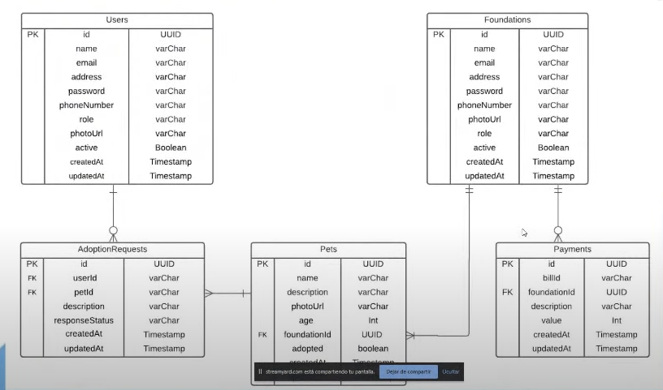

# Adogta

## Problema

- Los tramites presencales para adopcion de mascotas son muy largos y tediosos.
- Fundaciones y protectoras no tienen un sistema para gestionar las adopciones de sus mascotas.
- Los dueños de mascotas no tienen un sistema para gestionar las adopciones de sus mascotas.

## Descripción

Adogta es una plataforma que conecta a fundaciones con personas que quieren adoptar una mascota con el fin de facilitar la experiencia de adopcion. Las fundaciones pueden publicar sus mascotas para que sean adoptadas y las personas que quieren adoptar una mascota pueden buscar mascotas disponibles. Las fundaciones pueden calificar a las personas que adoptaron sus mascotas y las personas que adoptaron una mascota pueden calificar a los fundaciones.

## Tecnologías

### Backend
- Node.js
- Express
- MongoDB
- Mongoose
- JWT
- Bcrypt
- SendGrid
- Epayco

## Actualización
- [ ] 

## El trabajo que te toca hacer

- [ ] Get all foundations
- [ ] Get foundation by name
- [ ] Get all details of specific foundation and show all pets they have for adoption
- [ ] Show request status to specific user
- [ ] Comments and likes in pets
- [ ] Migrate to Stripe
- [ ] Modify images loading to multer library
